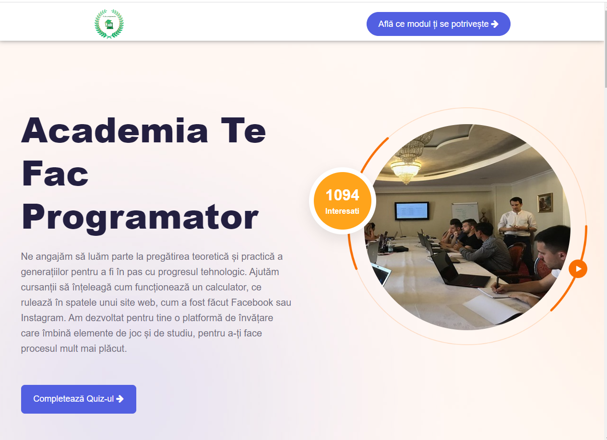
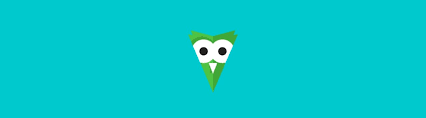
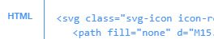
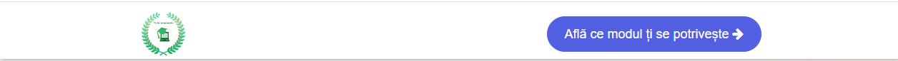
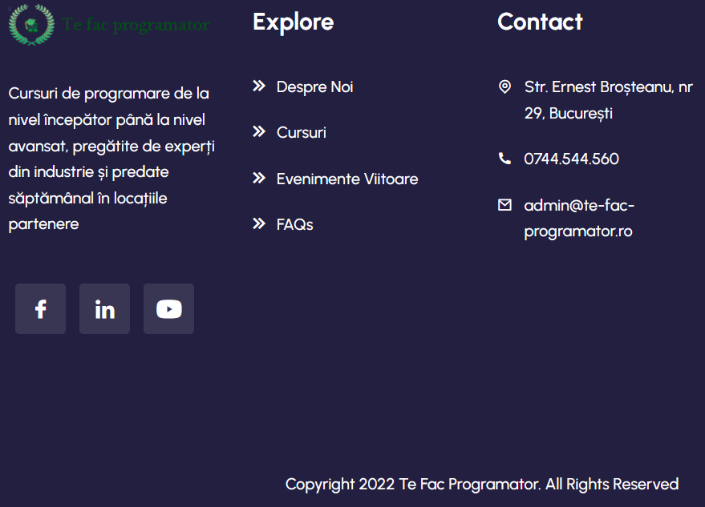
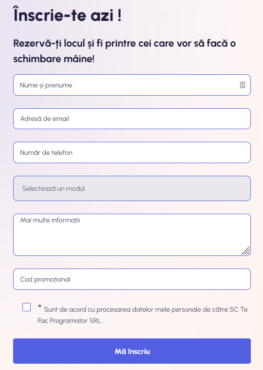
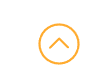
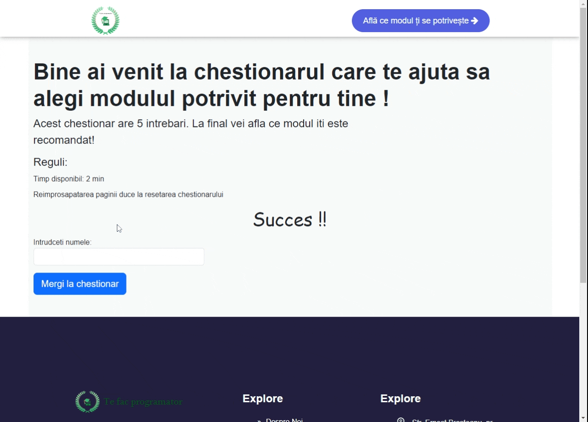
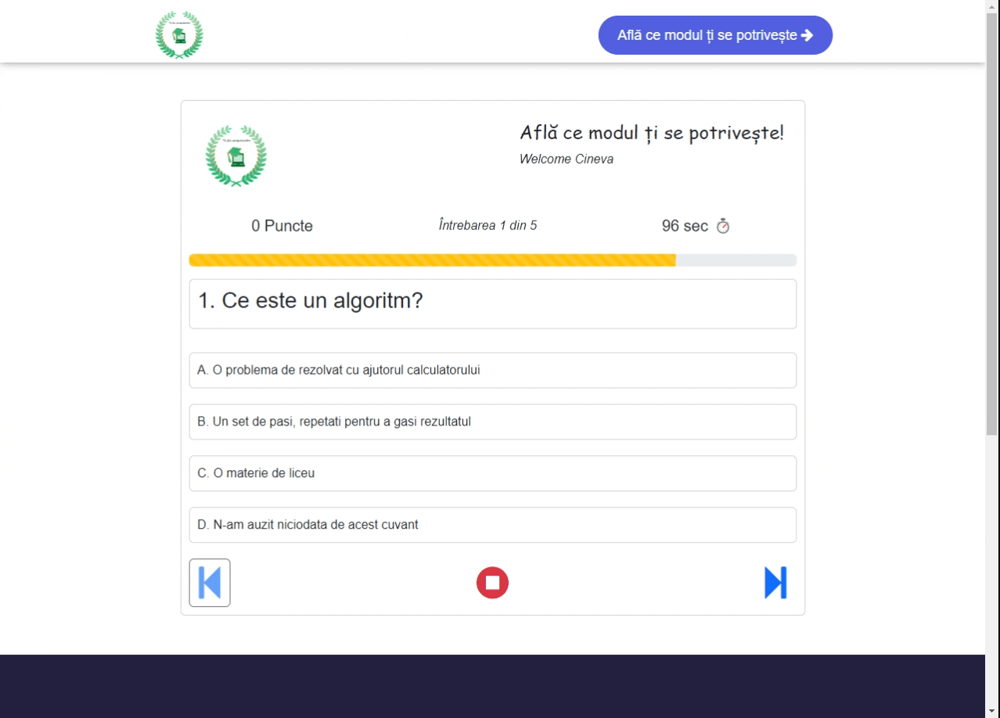
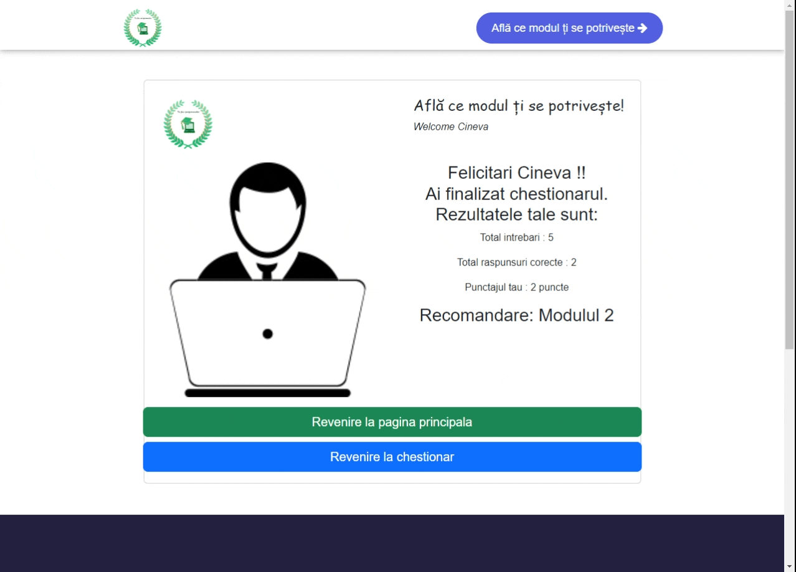

<!-- TABLE OF CONTENTS -->

<a name="readme-top"></a>

<details>
  <summary>Table of Contents</summary>
  <ol>
    <li>
      <a href="#about-the-project">About The Project</a>
      <ul>
        <li><a href="#built-with">Built With</a></li>
      </ul>
    </li>
    <li>
      <a href="#getting-started">Getting started</a>
      <ul>
        <li><a href="#prerequisites">Prerequisites</a></li>
        <li><a href="#installation">Installation</a></li>
      </ul>
    </li>
    <li><a href="#components-and-features">Components and Features</a>
    <ul>
        <li><a href="#navbar-and-footer-functionalities">Navbar and Footer functionalities</a>
            <ul>
              <li><a href="#navbar">Navbar</a></li>
              <li><a href="#footer">Footer</a></li>
            </ul>
        </li>
        <li><a href="#landing-page-components-and-funcionalities">Landing page components and funcionalities</a>
          <ul>
            <li><a href="#hero-section">Hero section</a></li>
            <li><a href="#features-section">Features section</a></li>
            <li><a href="#form-section">Form section</a></li>
            <li><a href="#locations-section">Locations section</a></li>
            <li><a href="#team-section">Team section</a></li>
            <li><a href="#back-to-top-button">Back to top button</a></li>
          </ul>
        </li>
        <li><a href="#quiz-component">Quiz component</a>
            <ul>
              <li><a href="#quiz-welcome">Quiz welcome</a></li>
              <li><a href="#quiz-main">Quiz main</a></li>
              <li><a href="#quiz-results">Quiz results</a></li>
          </ul>
        </li>
      </ul>
    </li>
    <li><a href="#contact">Contact</a></li>
  </ol>
</details>

<!-- ABOUT THE PROJECT -->

## About The Project

### TfpSite



This project is a homework for a course of FullStack web developer - the course is organized by a private programming academy and Anais Digital.

This project is meant to recreate a part of the original site of the academy and additionaly we added a new feature.
The original site link:(https://te-fac-programator.ro/)

`This project is not optimized for mobile devices.
The minimum width for a correct view is 650px.`

<p>
This is because for some components (that were made in the begining of the project) I did not define @media queries.
</p>
Some components like <mark style="background-color: #FFFF00">Enrolment form and Quiz</mark> were stylized using Bootstrap framework - which I discover later in the project!
<p>Also I have tried to use the Bootstrap in other components, but did not work (problems with installation) and I had to rename the classes that I used, adding "my" as prefix!</p>

<p align="right">(<a href="#readme-top">back to top</a>)</p>

### Built With

This project was generated with [Angular CLI](https://github.com/angular/angular-cli) version 15.0.0.
Also I have used for this project the next librarys and frameworks:

- <a href="https://angular.io">
  
  </a>
- <a href="https://getbootstrap.com/">
  
  </a>
- <a href="https://www.npmjs.com/package/ngx-owl-carousel-o">
  
  </a>
- <a href="https://fontawesome.com/v4/icons/">
  
  </a>
- <a href="http://svgicons.sparkk.fr/">
  
  </a>

<p align="right">(<a href="#readme-top">back to top</a>)</p>

<!-- GETTING STARTED -->

## Getting started

In the following steps you will find indication about all the steps you have to follow in order to run the project on your device:

### Prerequisites

Install the latest version of npm - node package manager:

- npm
  ```sh
  npm install npm@latest -g
  ```

### Installation

Follow the next steps in order to run the project on your device:

1. Clone the repo
   ```sh
   git clone https://github.com/nicudoran/tfp-site
   ```
2. Install NPM packages
   ```sh
   npm install
   ```
3. Run `ng serve` for a dev server.
   ```sh
   ng serve
   ```
4. Navigate to `http://localhost:4200/`. The application will automatically reload if you change any of the source files..

<p align="right">(<a href="#readme-top">back to top</a>)</p>

<!-- Components and Features -->

## Components and Features

### Navbar and Footer functionalities

### Navbar



<p>The navbar is fixed on the top of the page</p>
<p>The logo brand on the left is also a link to home page, in this case landing page: "/"</p>
<p>The button is a link to the quiz component. The links between components are defined in Angular routing module.</p>

### Footer



<p>The footer is fixed on the botton of the page</p>
<p>The Footer is split in three columns, each column containing different informations and links:</p>

1. Company logo, company description and social-media accounts link.
2. Links to different pages of the site - the links are routed to the original site.

3. Contact area

<p align="right">(<a href="#readme-top">back to top</a>)</p>

<!-- Landing page components and funcionalities -->

## Landing page components and funcionalities

### Hero section


### Features section


### Form section



### Locations section


### Team section


### Back to top button



<p>Back to top button is always visible when the page is scrolled</p>

<p align="right">(<a href="#readme-top">back to top</a>)</p>

<!-- Quiz component -->

## Quiz component

### Quiz welcome



### Quiz main



### Quiz results



<p align="right">(<a href="#readme-top">back to top</a>)</p>

<!-- CONTACT -->

## Contact

<a href="https://www.linkedin.com/in/doran-nicolae-daniel-2412431a" target="_blank"></a>

<p align="right">(<a href="#readme-top">back to top</a>)</p>
